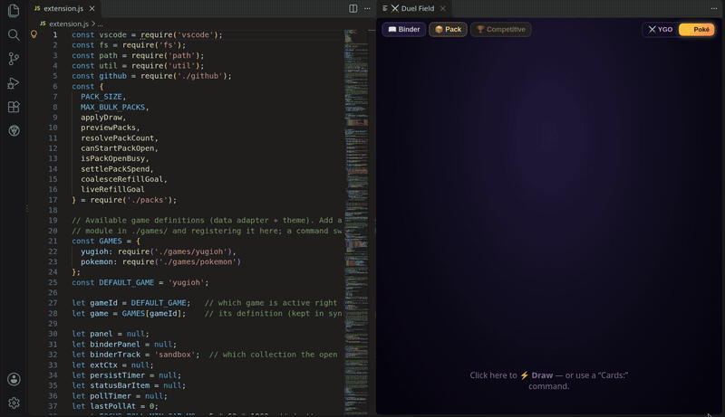
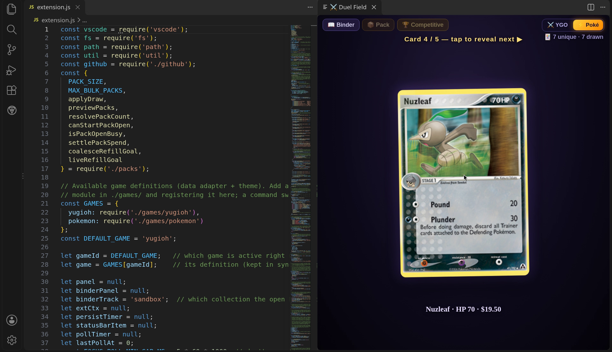
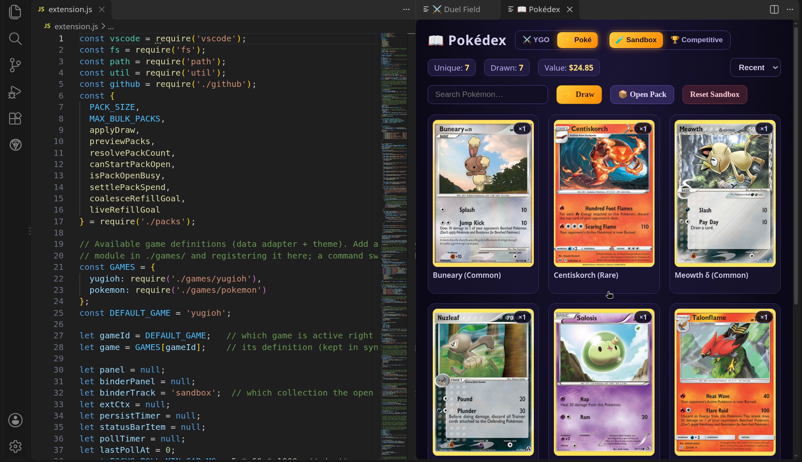

# 🎴 TCG Pulls

*It's time to d-d-d-duel!* Draw cards and open Yu-Gi-Oh and Pokémon packs as you code. Packs are earned per commit (bigger commits give more packs), and every pull lands in your Binder / Pokédex.

- **Yu-Gi-Oh**: cards from the free [YGOPRODeck API](https://ygoprodeck.com/api-guide/)
- **Pokémon**: TCG cards from [pokemontcg.io](https://docs.pokemontcg.io/)

**Sandbox** is always free. **Competitive 🏆** pays **1 / 2 / 3** packs for merges and direct pushes of **&lt;20 / 20–199 / 200+** lines. Cards fetch live; if the API is down, you get a heads-up instead of a card.

> Personal project. Yu-Gi-Oh art is Konami's; Pokémon art is Nintendo / The Pokémon Company's. This tool only *displays* cards fetched live from public fan APIs.

## Screenshots

<table>
  <tr>
    <td align="center" width="50%">
       
      <em>A pulled card mid-reveal (Nuzleaf)</em>
    </td>
    <td align="center" width="50%">
       
      <em>The Pokédex binder beside your code</em>
    </td>
  </tr>
</table>

## Play

Handed a `.vsix`? Extensions view → `⋯` → **Install from VSIX…**, then **Developer: Reload Window**.

From source: open this folder, press **F5**, then Command Palette → **Cards: Open Yu-Gi-Oh Field** or **Cards: Open Pokémon Field**. Draw, rip packs, and open the Binder from there.
